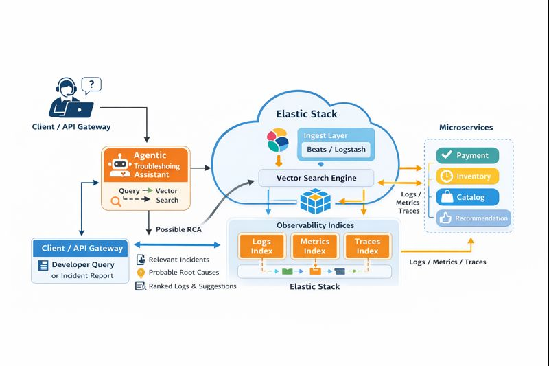

📌 This blog post was submitted to the Elastic Blog-a-thon Contest and is eligible to win a prize.

# agentic-rca-assistant
Agentic RCA Assistant is a microservices-based demonstration on how Elastic vector search can enhance troubleshooting, root-cause analysis, and service observability workflows using embeddings, semantic retrieval, and context-aware prompts.

# Agentic RCA Assistant with Elastic Vector Search

This repository accompanies the blog **"Building an Agentic RCA Assistant for Microservices using Elastic Vector Search"**, written for the Elastic Blogathon 2026.

The project explores how Elastic’s vector search capabilities can enhance Root Cause Analysis (RCA) in microservices by enabling semantic understanding of logs, traces, and contextual domain signals.

---

## 🎯 Why This Matters

Traditional microservices troubleshooting often relies on log-grep, dashboards, and tribal knowledge. While observability tools help visualize symptoms, identifying the root cause remains a highly contextual task.

Vector search changes this workflow by allowing **semantic similarity** across logs, traces, recent deployments, incident summaries, and knowledge artifacts. This makes the RCA process faster, more consistent, and easier to automate.

---

## 🧩 Architecture Overview

The RCA assistant works as a lightweight layer on top of existing microservices. It ingests operational signals into Elastic, embeds them as vectors, and uses retrieval to support RCA queries.

**Figure 1: System Architecture**

---

## 🚀 Key Capabilities

✔ Semantic RCA queries (e.g., *"Why payment retries failing?"*)  
✔ Context retrieval from logs + traces + domain knowledge  
✔ Agent-like reasoning using Elastic as memory  
✔ Hybrid scoring: vector + BM25 + metadata filters  
✔ Fits into existing observability stack  

---

## 🏗 Microservices Used in the Example

For demonstration purposes, the example workflow includes:

- `orders-service`
- `payment-service`
- `shipping-service`
- `inventory-service`

Each service emits operational logs and metadata into an ingestion layer.

---

## 🗃 Data Types Stored in Elastic

| Signal Type | Examples |
|---|---|
| Logs | Error logs, WARN logs, INFO logs |
| Deployment Context | Versions, feature flags, rollout timestamps |
| Incident Notes | RCA summaries, corrective actions |
| Domain Knowledge | Tribal knowledge, runbooks, FAQs |

These signals are embedded into vector fields to support semantic retrieval.

---

## 🧱 Core Workflow

1. **Ingest operational signals** into Elastic
2. **Embed textual artifacts** (e.g., logs, incident reports)
3. **Store embeddings** inside vector fields
4. **Query using semantic search**
5. **Aggregate retrieved context**
6. **Agent builds an RCA hypothesis**

See `examples/` for sample queries and responses.

---

## 🧪 Example RCA Query
"Customer payments failing intermittently after last deployment"

Response retrieves:

- Payment errors related to timeouts
- Feature flag enabling retry logic
- Recent deployment timestamp correlation
- Similar past incident from two months prior

---
## 🛠 Elastic Implementation Notes

The demo uses:

- `dense_vector` field for embeddings
- Hybrid `kNN + BM25` ranking for accuracy
- Elastic ingestion API for logs and metadata
- Embeddings generated using local LLM encoder

This remains implementation-agnostic so it works with Elastic Cloud as well as self-managed clusters.

---

## 📤 Sample Outputs

Located in the `examples/` directory.

---
## 🏁 Takeaways

- Elastic can act as both **memory + retrieval** for agentic workflows
- RCA benefits greatly from semantic retrieval because symptoms rarely match keyword strings
- Hybrid search + embeddings produce more reliable microservice diagnostics
- The pattern generalizes to SRE, DevOps, and platform engineering use-cases

---

## 👤 Author

**Prasad Naidu** — Senior Cloud & Platform Engineering Professional passionate about distributed systems, search, and applied AI.

---

## License

For evaluation and research purposes only.
